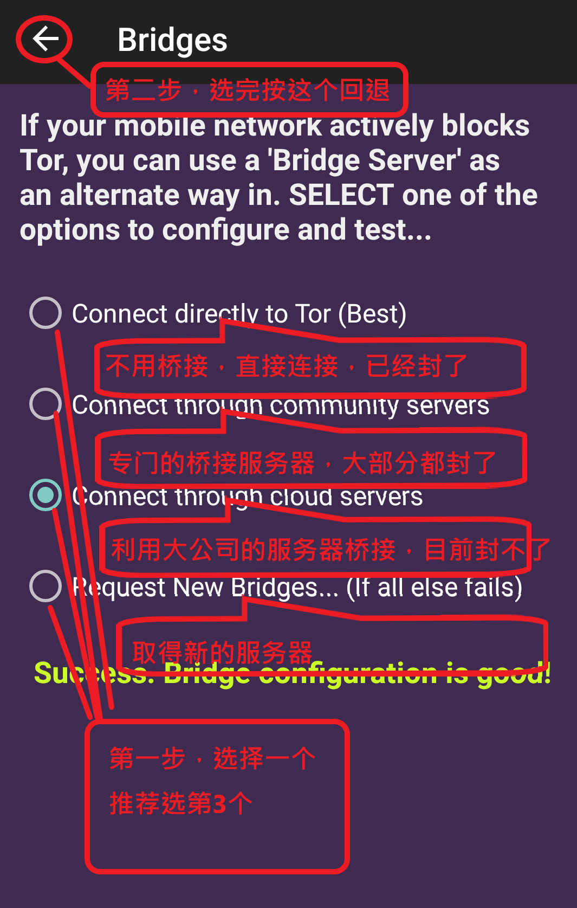

# howtouseorbotinchina
how to use Orbot for Chinese mainland

This is not a project.

This is just for the people in Chinese mainland, who can't get any infomation of Orbot.

安装完成Orbot后， 第一次启动按照以下图示设置:

1.

2.

3.

4.

5.

6.

7.

8.

9.

10.

